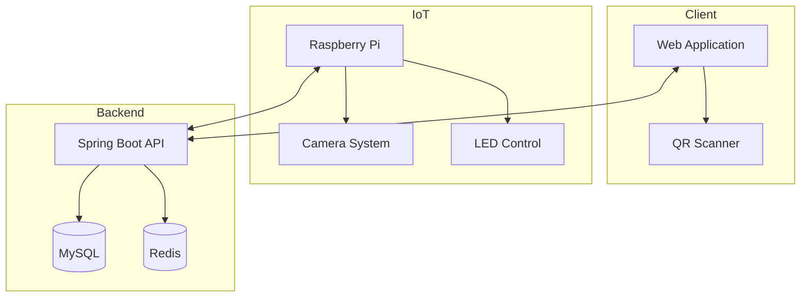
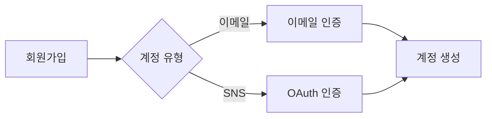
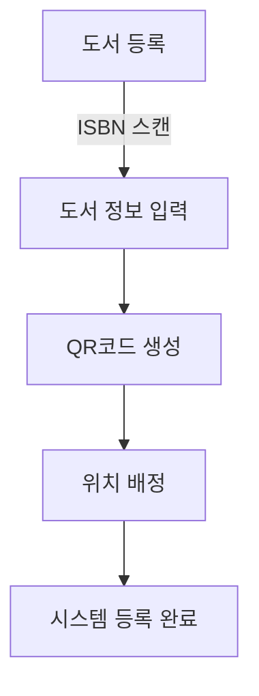

# 📚 LoveYourShelf
> *스마트한 도서관 경험을 위한 무인 관리 시스템*

 

## 📋 목차
1. [프로젝트 소개](#-프로젝트-소개)
2. [시스템 아키텍처](#-시스템-아키텍처)
3. [기술 스택](#-기술-스택)
4. [주요 기능](#-주요-기능)
5. [팀원 소개](#-팀원-소개)
6. [프로젝트 현황](#-프로젝트-현황)

## 🎯 프로젝트 소개

### 개요
LoveYourShelf는 상주 사서 없이 운영되는 스마트 도서관 시스템입니다. QR코드와 IoT 기술을 결합하여 도서 관리를 자동화하고, 사용자 경험을 혁신적으로 개선합니다.

### 특징
| 기능 | 설명 |
|------|------|
| 📱 QR 기반 관리 | QR코드를 통한 간편한 도서 대출/반납 |
| 🎨 직관적 분류 | 장르별 컬러 코딩 시스템 |
| 📸 실시간 추적 | 라즈베리파이 카메라로 도서 위치 실시간 모니터링 |
| 💡 LED 안내 | LED 선을 통한 직관적인 도서 위치 안내 |
| ⚡ 자동화 시스템 | 완전 자동화된 대출/반납 프로세스 |
| 🔔 실시간 알림 | 즉각적인 오류 감지 및 관리자 알림 |

## 🔍 시스템 아키텍처

## 🛠 기술 스택

### Frontend
| 분류         | 기술                                                                                                             |
|--------------|------------------------------------------------------------------------------------------------------------------|
| 프레임워크   |            |
| 언어         |  |
| 상태관리     |            |
| 빌드 도구    |              |

### Backend
| 분류         | 기술                                                                                                               |
|--------------|--------------------------------------------------------------------------------------------------------------------|
| 언어         |                  |
| 프레임워크   |  |
| 데이터베이스 |              |
| 캐시         |              |
| ORM          |              |
| 서버         |              |
| 인증         |    |

### DevOps
| 분류         | 도구                                                                                                             |
|--------------|------------------------------------------------------------------------------------------------------------------|
| 버전관리     |          |
| 프로젝트관리 |               |
| 컨테이너     |          |
| CI/CD        |      |
| 클라우드     |         |

## 💫 주요 기능

### 회원 관리

### 도서 관리 프로세스

## 👥 팀원 소개

| 이름 | 역할 | 담당 |
|------|------|------|
| 강수진 | Developer | Backend / Frontend |
| 김용명 | Developer | Backend / Frontend |
| 이동욱 | Developer | Backend / Frontend |
| 차윤영 | Developer | Backend / Frontend |
| 배남석석 | EM | Engineering Manager / AI |

## 📈 프로젝트 현황

### 진행상황
☑️ 팀 미팅 완료  
☑️ 기능 명세서 작성  
☑️ API 명세서 작성  
☑️ DB 설계  
☑️ BE 컨벤션 작성  
☑️ UX/UI 프로토타입 제작  
☑️ CI/CD 구축

---
© 2025 LoveYourShelf. All Rights Reserved.